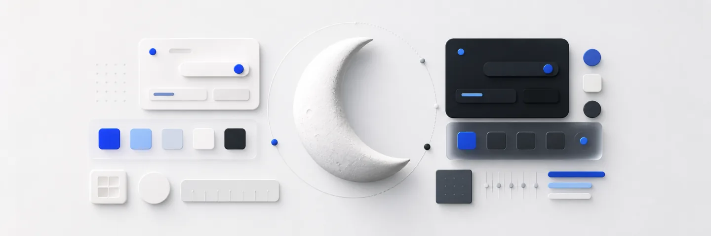

# halfmoon

공통 디자인 시스템 모노레포. 단일 소스는 DTCG 토큰(`packages/tokens/src/`)이며,
빌드가 CSS 변수·타입된 JS 객체·Tailwind v4 `@theme` 매핑을 생성한다.
React 컴포넌트(`packages/react`)는 shadcn을 halfmoon 토큰 브리지로 테마링한다.
dist/는 커밋된다 (git 설치 시 빌드 불필요).

- 컴포넌트 데모(Storybook): https://halfmoon-project.github.io/halfmoon-design/
- 사용법: `docs/consuming-web.md`
- iOS/SPM 사용법: `docs/consuming-ios.md`
- Android/Compose 사용법: `docs/consuming-android.md`
- 토큰 규칙: `docs/naming.md`

## 개발

```bash
pnpm install
pnpm run check       # 전 패키지 build + test
pnpm --filter @halfmoon/react storybook   # 컴포넌트 워크벤치
```

## 릴리스 (패키지별)

```bash
pnpm run check
git add packages/*/dist && git commit -m "chore: rebuild dist"   # dist 변경 시
# packages/<pkg>/package.json의 version 수동 인상 후:
git commit -am "chore(tokens): v0.2.0" && git tag tokens-v0.2.0   # react는 react-v*
```

## 라이센스

[PolyForm Noncommercial 1.0.0](./LICENSE) — 개인·비상업 사용은 자유롭고,
**상업적 사용은 별도 허락이 필요합니다** (GitHub 이슈로 문의).
